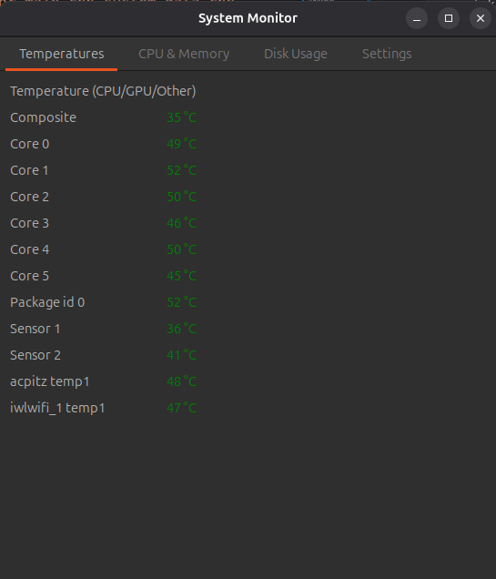
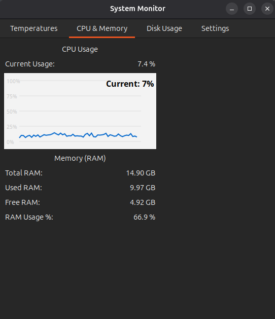
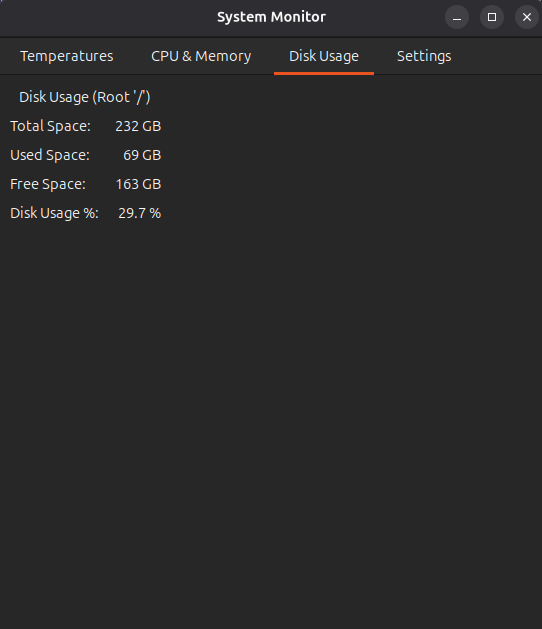
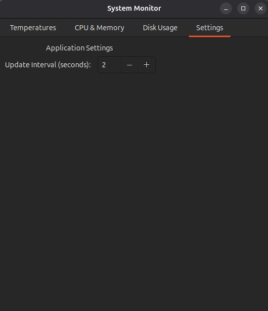

# System Monitor - Ứng dụng giám sát hệ thống Linux

## Mô tả
System Monitor là một ứng dụng giám sát hệ thống được viết bằng C++ với giao diện GTK3. Ứng dụng cho phép theo dõi thời gian thực các thông số quan trọng của hệ thống như nhiệt độ, sử dụng CPU, bộ nhớ RAM và dung lượng ổ cứng.

## Tính năng chính

### 1. Giám sát nhiệt độ
- Hiển thị nhiệt độ CPU, GPU và các cảm biến khác
- Tự động phát hiện cảm biến từ `/sys/class/hwmon/`
- Cảnh báo màu sắc theo mức độ nhiệt độ:
  - Xanh lá: Nhiệt độ bình thường (< 75°C)
  - Cam: Cảnh báo (75-85°C)
  - Đỏ: Nguy hiểm (> 85°C)

### 2. Giám sát CPU
- Hiển thị phần trăm sử dụng CPU hiện tại
- Biểu đồ theo thời gian thực hiện thị lịch sử sử dụng CPU
- Cập nhật liên tục từ `/proc/stat`

### 3. Giám sát bộ nhớ RAM
- Tổng dung lượng RAM
- RAM đã sử dụng
- RAM còn trống
- Phần trăm sử dụng RAM

### 4. Giám sát ổ cứng
- Dung lượng tổng của phân vùng gốc (/)
- Dung lượng đã sử dụng
- Dung lượng còn trống
- Phần trăm sử dụng ổ cứng

### 5. Cài đặt
- Điều chỉnh khoảng thời gian cập nhật (1-10 giây)
- Giao diện tab dễ sử dụng

## Yêu cầu hệ thống
- Hệ điều hành Linux
- GTK3 development libraries
- GCC compiler với hỗ trợ C++11 trở lên
- Các thư viện hệ thống chuẩn

## Cài đặt dependencies

### Ubuntu/Debian:
```bash
sudo apt-get install build-essential libgtk-3-dev pkg-config
```

### CentOS/RHEL/Fedora:
```bash
sudo yum install gcc-c++ gtk3-devel pkgconfig
# hoặc với dnf:
sudo dnf install gcc-c++ gtk3-devel pkgconfig
```

## Biên dịch và chạy

### Biên dịch
```bash
mkdir build
cd build
cmake ..
make
```

### Biên dịch thủ công:
```bash
g++ -std=c++11 -o system_monitor main.cpp system_data.cpp gui_manager.cpp \
    `pkg-config --cflags --libs gtk+-3.0` -pthread
```

### Chạy ứng dụng:
```bash
./system_monitor
```

## Screenshots

<table> <tr> <td align="center"> <strong>Nhiệt độ hệ thống</strong><br>  </td> <td align="center"> <strong>CPU & RAM</strong><br>  </td> </tr> <tr> <td align="center"> <strong>Ổ đĩa</strong><br>  </td> <td align="center"> <strong>Cài đặt</strong><br>  </td> </tr> </table>

## Cách sử dụng

1. **Khởi động ứng dụng**: Chạy file thực thi `system_monitor`

2. **Xem nhiệt độ**: Tab "Temperatures" hiển thị nhiệt độ của tất cả cảm biến được phát hiện

3. **Giám sát CPU và RAM**: Tab "CPU & Memory" hiển thị:
   - Sử dụng CPU hiện tại
   - Biểu đồ lịch sử sử dụng CPU
   - Thông tin chi tiết về RAM

4. **Kiểm tra ổ cứng**: Tab "Disk Usage" hiển thị thông tin về phân vùng gốc

5. **Cài đặt**: Tab "Settings" cho phép điều chỉnh tần suất cập nhật
